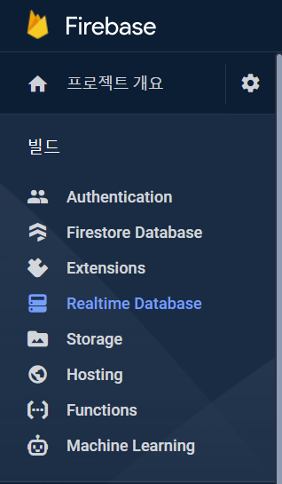
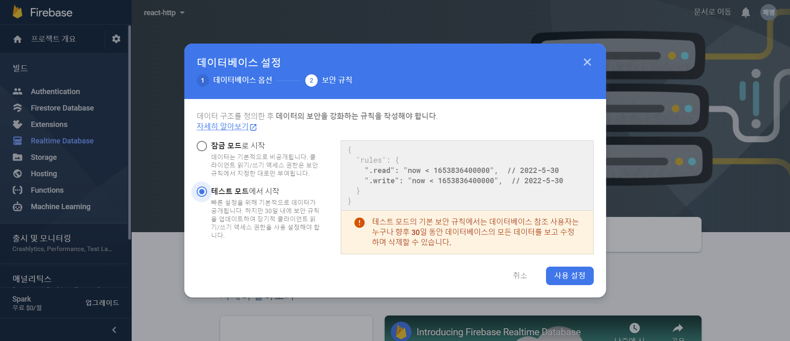

# Get 요청 보내기
https://swapi.dev/

dummy api를 불러올 수 있는 사이트가 있다. 이 사이트를 이용해서 get 요청을 보내보자.

``` 
  function fetchMoviesHandler() {
    fetch('https://swapi.dev/api/films').then(data => data.json()).then(ele => {
      const MovieData = ele.results.map(movies => {
        return {
          id: movies.episode_id,
          title: movies.title,
          openingText: movies.opening_crawl,
          releaseDate: movies.release_date,
        }
      })
      setMovies(MovieData);


    })
  }

```
위와 같은 코드는 then chain을 이용한 것으로 가독성이 떨어진다.
따라서 다음과 같은 코드로 변환할 수 있다.
```
  async function fetchMoviesHandler() {
    const response = await (await fetch('https://swapi.dev/api/films'));
    const data = await response.json();
    const transformedMovies = data.results.map(movies => {
      return {
        id: movies.episode_id,
        title: movies.title,
        openingText: movies.opening_crawl,
        releaseDate: movies.release_date,
      }
    })
    setMovies(transformedMovies);
  }
```
***
# 로딩 및 데이터 State 처리하기
데이터가 로딩되고 있을때와 로딩이 완료되었지만 표시할 데이터가 없을때를 구분해서 표시해 주어야 한다.
```
  const [isLoading,setIsLoading] = useState(false);
  async function fetchMoviesHandler() {
    setIsLoading(true);
    /*function body*/
    setIsLoading(false);
  }

```

그리고 렌더링되는 곳 또한 수정해준다.
```
{!isLoading && movies.length > 0 && <MoviesList movies={movies} />}
{!isLoading && movies.length == 0 && <p>no data</p>}
{isLoading && <p>Loading ...</p>}
```
***

# Http 오류 처리하기
예상치 못한 오류가 발생하면 계속 Loading 상태가 될 수 있다.
axios 에서는 이런 오류의 종류를 반환할 수 있지만 fetch는 그렇지 못하다.
fetch로 오류를 처리해보자. (then chain을 사용할 땐 .catch를 사용해야 하지만 이번 경우에는 try-catch문을 사용한다.)


`const [error,setError] = useState(null);`

에러의 state를 정의해준다.

`if(!response.ok) throw new Error('something wrong');`

response의 문제가 있다면 에러를 알려준다.

```
catch(error){
  setError(error);
}
```
catch문에서 에러를 받아준다.
그리고 그 문자열을 출력해준다.(error.message 인것 주의)

`{!isLoading && error && <p>{error.message}</p>}`

## 출력 깔끔하게 하기
content라는 변수를 만들고 상태에 따라 출력될 대상을 바꾸어준다.

```
  let content = <p>no data</p>;
  if (movies.length > 0) content = <MoviesList movies={movies} />
  if (isLoading) content = <p>Loading ...</p>;
  if (error) content = <p>{error.message}</p>;
```
```
<section>
    {content}
</section>
```

# 요청에 useEffect() 사용하기
보통의 웹 앱은 버튼을 눌러 렌더링 하지 않는다.
사이트에 접근할때 자동으로 렌더링 되므로 그렇게 만들어주도록 하자.
```
useEffect(() => {
    fetchMoviesHandler();
  }, [fetchMoviesHandler]);
```
위와 같이 의존성을 추가해준다면 페이지가 재 렌더링 될 때 fetchMoviesHandler 함수의 객체가 바뀌므로 무한루프에 빠지게 된다. 무한루프를 방지하기 위해선 `useCallBack` 훅을 사용해야 한다.

```
const fetchMoviesHandler = useCallback(async () => {
    ...
  },[]);
```

>`useMemo` 는 특정 결과값을 재사용 할 때 사용하는 반면,`useCallback` 은 특정 함수를 새로 만들지 않고 재사용하고 싶을때 사용합니다.


# POST 요청 보내기
>Firebase 이용



