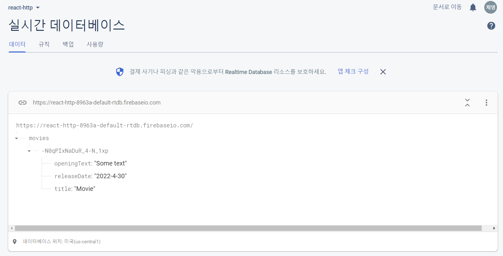
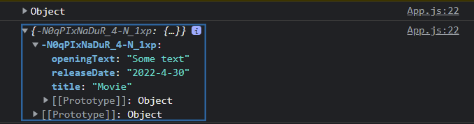

# POST 요청 보내기

`const response = await fetch('https://react-http[본인api 주소].firebaseio.com/movies.json');`
로 수정

post를 보내기 위해서 함수를 다음과 같이 수정한다. 
```
  async function addMovieHandler(movie) {
    const response =
      await fetch('https://react-http-8963a-default-rtdb.firebaseio.com/movies.json', {
        method: 'POST',
        body: JSON.stringify(movie),
        headers: {
          'Content-Type': 'application/json'
        }
      });
  }
```

그러면 Realtime Database에 추가가 된다.



console.log를 찍어보면 다음과 같은 객체 형태임을 알 수 있다.



그렇게 되면 fetchMovie 함수가 동작을 하지 않기 때문에 loadedData 배열을 만들어서 형태를 변환해준다.

```
let loadedData = [];
for (let key in data) {
    loadedData.push({
        id: key,
        title: data[key].title,
        openingText: data[key].openingText,
        releaseDate: data[key].releaseDate
    })
}
```