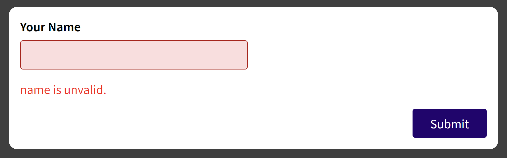
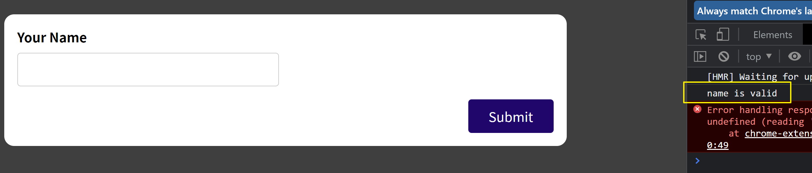

# 양식

## 양식이 복잡한 이유

한개 혹은 그 이상의 입력값이 유효하지 않을 경우 확인해야한다.  
비동기 유효성검사의 경우 서버로 보내서 유효성을 검사해야한다. (이메일 유효한지 검사)  
어디가 유효하지 않은지 알아내고 그 부분을 강조해 주어야 한다.  
유효하지 않은 데이터는 제출되거나 저장되게 해선 안된다.  
유효성 검사하는 타이밍

- 폼이 제출되었을 때
- 포커스를 잃었을 때
- 매번의 키 스트로크 마다

## 입력값을 가져오는 방법

- 매 스트로크마다 가져오는 법 : `useState`를 이용
- 제출되기 전에 가져오는 법 : `useState`의 마지막 상태를 이용, `useRef`이용

## 유효성을 판단

유효성을 판단하고 사용자에게 피드백을 할 수 있다.  
`const [nameIsValid, setNameIsValid] = useState(false);`

```javascript
const submitHandler = (e) => {
  e.preventDefault();
  if (enteredName.trim() === "") {
    setNameIsValid(false);
    return;
  }
  setNameIsValid(true);
  console.log(enteredName);
};
```

`{!nameIsValid && <p style={{ color: "red" }}>name is unvalid.</p>}`
로써 사용자 피드백을 한다. 하지만 단점이 존재하는데 `nameIsValid`를 `false`로 초기화 해놓았기 때문에 아무것도 입력하지 않아도 부정 피드백을 받게된다.


아무것도 입력하지 않은 상황  
이 상황을 빠져나가기 위해 `nameIsvalid`를 `true`로 초기화 해주는 방법이 있다. 겉보기에는 문제가 없이 잘 작동하지만 `useEffect`를 사용하는 다음과 같은 상황에선 문제가 될 수 있다.


위와 같은 상황을 방지하기 위해서 하나의 `State`가 더 필요하다.

```javascript
const [enteredNameTouched, setEnteredNameTouched] = useState(false);
const nameIsInvalid = enteredNameTouched && !nameIsValid;
```

```javascript
const nameClasses = nameIsInvalid ? "form-control invalid" : "form-control";
```

```javascript
{
  nameIsInvalid && <p style={{ color: "red" }}>name is unvalid.</p>;
}
```
