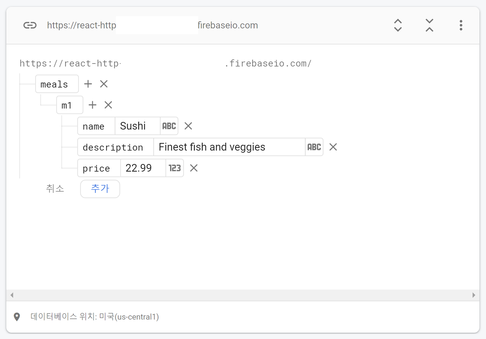
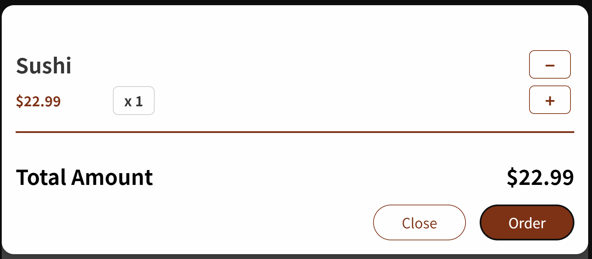
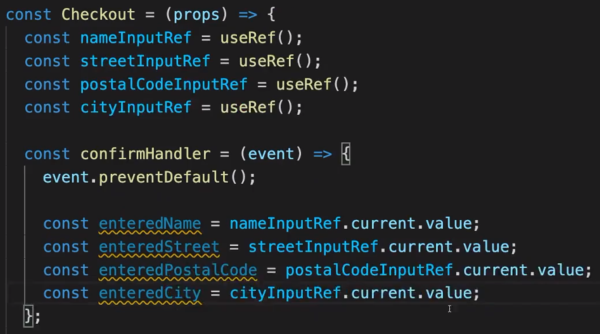

# 음식 주문 앱에 Http 및 양식 추가

## firebase로 데이터 이동



## http를 통해 meals 가져오기

```javascript
const [meals, setMeals] = useState([]);

useEffect(() => {
  const mealsFetchHandler = async () => {
    const response = await fetch(
      "https://react-http-8963a-default-rtdb.firebaseio.com/meals.json"
    );
    const responseData = await response.json();
    let loadedMeals = [];
    for (const key in responseData) {
      loadedMeals.push({
        id: key,
        name: responseData[key].name,
        description: responseData[key].description,
        price: responseData[key].price,
      });
    }
    setMeals(loadedMeals);
  };
  mealsFetchHandler();
}, []);
```

헤맨것 : firebase로 이동  
`mealsFetchHandler`를 바깥에서 선언하면 무한루프 돔  
`.json()` 붙인것  
배열에 추가하는 방식 push  
`const key in responseData`  
`responseData[key].name` 의 방식으로 찾는 것

## 로딩 state 다루기

```javascript
const [isLoading, setIsLoading] = useState(false);
```

```javascript
setIsLoading(true);
    const mealsFetchHandler = async () => {...};
    setTimeout(() => {
        mealsFetchHandler();
        setIsLoading(false);
      },2000);
```

## error handle

```javascript
setIsLoading(true);
const mealsFetchHandler = async () => {
  const response = await fetch(
    "https://react-http-8963a-default-rtdb.firebaseio.com/meals.json"
  );
  if (!response.ok) {
    throw new Error("something went wrong!");
  }
  const responseData = await response.json();
  let loadedMeals = [];

  for (const key in responseData) {
    loadedMeals.push({
      id: key,
      name: responseData[key].name,
      description: responseData[key].description,
      price: responseData[key].price,
    });
  }
  setMeals(loadedMeals);
  // try {
  //   setMeals(loadedMeals);
  // } catch (error) {
  //   console.log("error catch");
  //   setError(error.message);
  // }
};
setTimeout(() => {
  mealsFetchHandler().catch((error) => {
    setIsLoading(false);
  });
  setError(error.message);
}, 2000);
```

주석으로 처리한 대로 try/catch 블록을 사용하면 오류가 반영이 되지 않는다.
왜냐하면 `mealsFetchHandler` 함수는 비동기로 실행이 되기 때문이다.
따라서 `mealsFetchHandler.catch`블록으로 비동기 실행을 시켜주어야 한다.

## 양식 넣기


Order 버튼을 눌렀을 때 사용자 양식을 입력하는 창이 나오게 하는것이 목적.
confirm 버튼과 cancel 버튼을 클릭할 수 있게 만들고 두 버튼은 안나오게 만든다.
Checkout.jsx 만들기 (form)

```javascript
<form>
  <div className={classes.control}>
    <label htmlFor='name'>Your name</label>
    <input type='text' id='name' />
  </div>
  ...
  <button type='button' onClick={props.onCancel}>
    Cancel
  </button>
  <button>Confirm</button>
</form>
```

button은 부모 component의 onClose 함수를 실행시키도록 했다.
Cart.js에서

```javascript
{
  orderClicked ? <Checkout onCancel={props.onClose} /> : modalAction;
}
```

두버튼을 나오지 않게, Checkout이 나오게 만들었다 .

form을 제출하면 처리할 함수도 만들어 준다.

```javascript
const CheckoutHandler = (event) =>{
        event.preventDefault();
    }
  return (
    <form onSubmit={CheckoutHandler}>
```

## 양식 값 읽기



## 데이터 제출 및 전송하기

1. 입력된 데이터 유효성 검사하기

   - 유효성 검사하는 helper function 만들기
   -

   ```javascript
   const isEmpty = (input) => input.trim().length === 0;
   const isFiveChar = (input) => input.trim().length === 5;

   const enteredNameIsValid = !isEmpty(enteredName);
   const enteredStreetIsValid = !isEmpty(enteredStreet);
   const enteredPostalIsValid = isFiveChar(enteredPostal);
   const enteredCityIsValid = !isEmpty(enteredCity);
   ```

2. 전체 form이 유효하지 않은 경우 return
   ```javascript
   if (!formIsValid) return;
   ```
3. formvalidity state 만들어주기 & setvalidity

```javascript
setFormInputValidity({
  name: enteredNameIsValid,
  street: enteredStreetIsValid,
  postal: enteredPostalIsValid,
  city: enteredCityIsValid,
});
```

4. 각자 inputvalid를 이용해서 경고문 표현하기

```javascript
const nameControlClasses = `${classes.control} ${
  formInputValidity ? "" : classes.invalid
}`;

{
  !formInputValidity.name && <p>please enter your name.</p>;
}
```

5. 경고문 클래서 동적 지정
6. userData 부모 컴포넌트로 보내기

```javascript
props.onSubmit({
  name: enteredName,
  street: enteredStreet,
  postal: enteredPostal,
  city: enteredCity,
});
```

7. 받은 userData와 CartItem을 POST로 서버에 보내기

```javascript
const submitHandler = (userData) => {
  fetch("https://meals-project-72c26-default-rtdb.firebaseio.com/order.json", {
    method: "POST",
    body: JSON.stringify({
      user: userData,
      order: cartCtx.items,
    }),
  });
};
```

#

## 더 나은 사용자 피드백 추가하기

1. submitting 중인지 판단하기
2. did submit 판단하기
   ```javascript
   const [isSubmitting, setIsSubmitting] = useState(false);
   const [didSubmit, setDidSubmit] = useState(false);
   ```
3. 상황 분류해서 표시하기

   ```javascript
   <Modal onClose={props.onClose}>
     {didSubmit
       ? didSubmitModalContent
       : isSubmitting
       ? isSubmittingModalContent
       : cartModalItem}
   </Modal>
   ```

4. 동기 처리 해주기

   ```javascript
   const submitHandler = async (userData) => {
     setIsSubmitting(true);
     await fetch(
       "https://meals-project-72c26-default-rtdb.firebaseio.com/order.json",
       {
         method: "POST",
         body: JSON.stringify({
           user: userData,
           order: cartCtx.items,
         }),
       }
     );
     setIsSubmitting(false);
     setDidSubmit(true);
   };
   ```

5. Cart 비우기
   store/cart-context.js 이동

   ```javascript
   if (action.type === "CLEAR") {
     return defaultCartState;
   }
   ```

   ```javascript
   const CartContext = React.createContext({
     items: [],
     totalAmount: 0,
     addItem: (item) => {},
     removeItem: (id) => {},
     clearItem: () => {},
   });
   ```

   ```javascript
   if (action.type === "CLEAR") {
     return defaultCartState;
   }
   ```

   ```javascript
   const clearItemFormCartHandler = () => {
     dispatchCartAction({ type: "CLEAR" });
   };
   ```

6. Cart.js에 추가해주기
   SubmitHandler에 추가해주기

   ```javascript
   cartCtx.clearItem();
   ```
