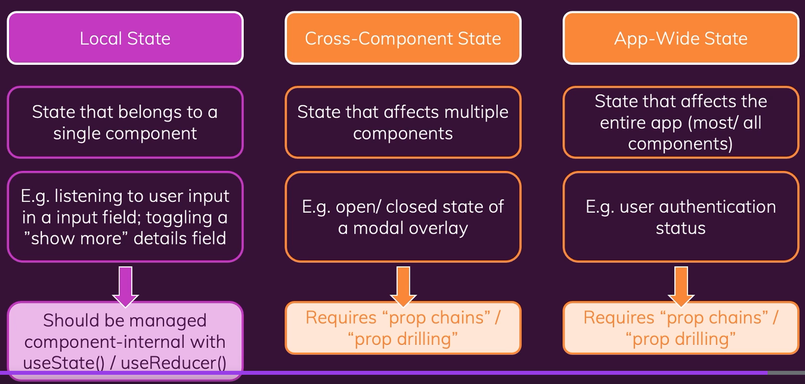
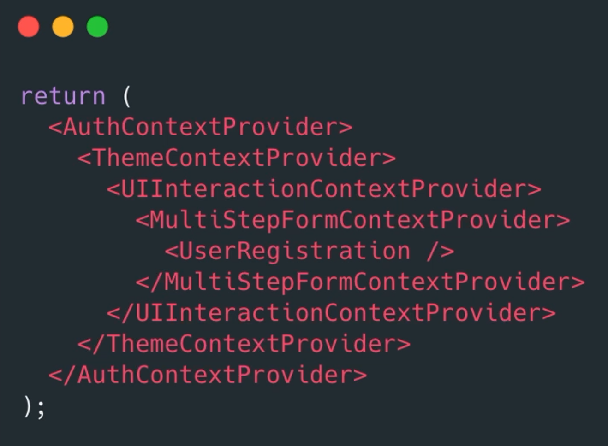
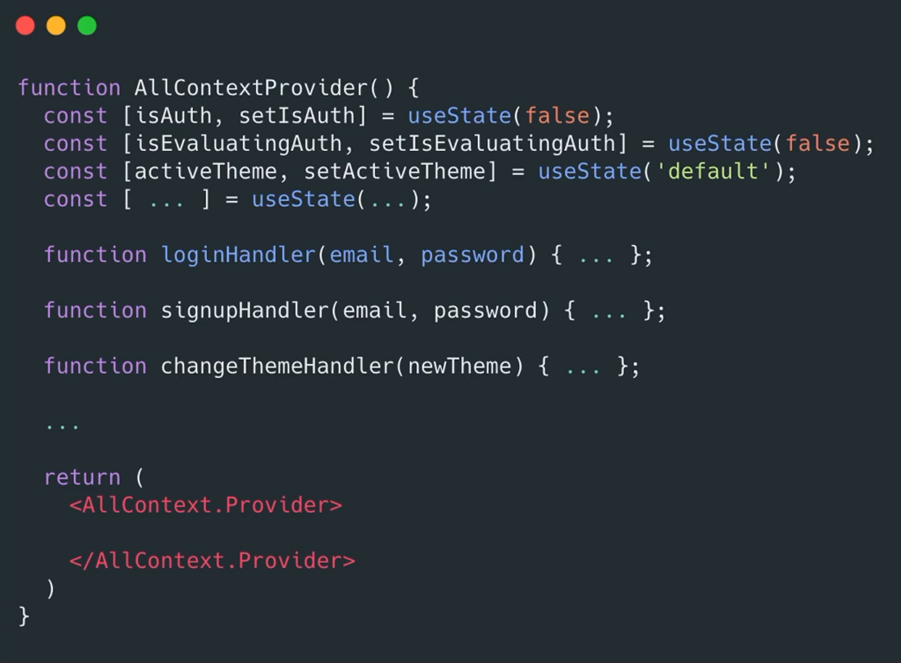
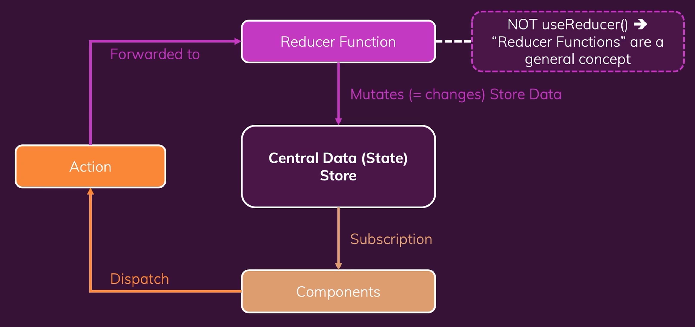
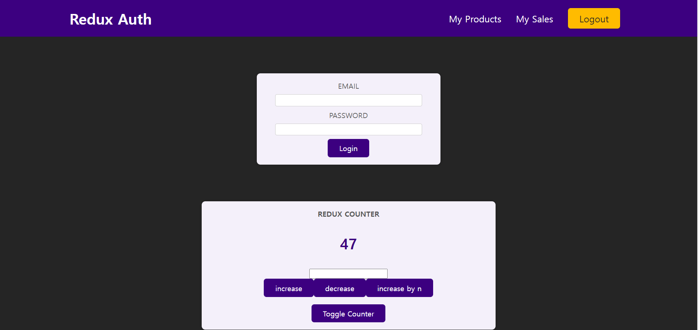

# Redux

## State에 대한 관점



- local state
  - 한개의 component에 관여하는 state
  - toggle이나 input
- Cross-component
  - 여러개의 component에 관여하는 state
  - props chain , drilling 이용 -> React Context
  - modal 열때는 modal 바깥쪽의 state 이용하지만 닫을때는 modal component에서 control 해줌
- App-wide State
  - app 전반에 걸쳐 사용하는 state
  - props chain , drilling 이용 -> React Context
  - 로그인 인증

## React Context vs Redux

React Context가 있는데 Redux를 사용하는 두가지 이유

1. Complex Setup / Management
   - 중첩된 Provider를 사용해야함
     
   - 중첩 Provider를 사용하지 않으려면 하나의 Context 안에 여러 기능을 수행해야 함
     
2. Performance
   - 고빈도의 상태 업데이트를 Context에서 이용하면 성능이 저하될 수 있음
     

## Redux 작동방식



## Redux 설치하기

1. 비어있는 폴더를 준비한다.
2. redux-demo.js 파일을 만든다.
3. `npm init -y` 를 통해 `package.json`을 만든다.
4. `npm install redux`
5. `const redux = require('redux');`를 통해서 서드파티 라이브러리를 `import` 할 수 있다.

## Redux 개념 탐색

```javascript
const redux = require("redux");
//서드파티 라이브러리 불러오기

const counterReducer = (state = { counter: 0 }, action) => {
  return {
    counter: state.counter + 1,
    //일반적으로 객체를 반환
  };
};

const store = redux.createStore(counterReducer);
//저장소와 작업하는것은 reducer

console.log(store.getState());

const counterSubscriber = () => {
  const latestState = store.getState();
  console.log(latestState);
};
// 구독함수 -> reducer 트리거 될때마다 업데이트
// 항상 최신상태

//함수를 실행하라고 말해줘야함
store.subscribe(counterSubscriber);
//redux가 직접 실행
//남은건 액션, dispatch는 액션을 발송
store.dispatch({ type: "INCREMENT" });
```

터미널에서 `node 파일이름`으로 실행 할 수 있다.

## 더많은 개념

- reducer 함수 세분화

```javascript
const counterReducer = (state = { counter: 0 }, action) => {
  if (action.type === "INCREMENT") {
    return {
      counter: state.counter + 1,
      //일반적으로 객체를 반환
    };
  }
  if (action.type === "DECREMENT") {
    return {
      counter: state.counter - 1,
      //일반적으로 객체를 반환
    };
  }
  return state;
};
```

#

## 새 프로젝트 시작하기

1.  `npm install redux`
2.  `npm install react-redux`
3.  src에 `store/index.js` 만들기
4.  index.js

    ```javascript
    import { createStore } from "redux";
    const counterReducer = (state = { counter: 0 }, action) => {
      if (action.type === "increment") {
        return {
          counter: state.counter + 1,
        };
      }
      if (action.type === "decrement") {
        return {
          counter: state.counter - 1,
        };
      }
      return state;
    };
    const store = createStore(counterReducer);
    export default store;
    ```

    주의!!! state 초기값을 지정해 주어야함

    ```javascript
    const counterReducer = (state, action);
    ```

5.  App 에 Provider 설정

    1. import

    ```javascript
    import store from "./store/index";
    import { Provider } from "react-redux";
    ```

    2.  wrap

    ```javascript
    <Provider store={store}>
      <App />
    </Provider>
    ```

6.  useSelector 훅
    `import { useSelector } from "react-redux";`

    ```javascript
    const counter = useSelector((state) => state.counter);
    ```

    `counter` 변수를 사용할 수 있음

7.  dispatch 함수 사용하기
    ```javascript
    import { useSelector, useDispatch } from "react-redux";
    const dispatch = useDispatch();
    const incrementHandler = () => {
      // store.dispatch({ type: "increment" });
      dispatch({ type: "increment" });
    };
    ```
8.  n 증가시키기
    reducer 함수를 추가해준다.

    ```javascript
    if (action.type === "increase") {
      return {
        counter: state.counter + action.value,
      };
    }
    ```

    ```javascript
    const increase5Handler = () => {
      dispatch({
        type: "increase",
        value: parseInt(numberInputRef.current.value),
      });
    };
    ```

9.  toggle도 redux로 작업하기
    ```javascript
    const toggleCounterHandler = () => {
      // if (toggle) setToggle(false);
      // else setToggle(true);
      dispatch({ type: "togglecontrol" });
    };
    ```
    ```javascript
    if (action.type === "togglecontrol") {
      return {
        ...state,
        toggle: !state.toggle,
      };
    }
    ```

**_절대 기존 state를 변경하면 안된다. 새 객체를 반환해야 한다._**

## 리덕스 도전과제 및 리덕스 툴킷

### 기존 리덕스의 문제점

- 식별자 (action.type) 오타가 나면 안됨
- 앱이 커지면 식별자가 겹칠 수도 있음
- redux 파일이 너무 커짐
- 반환해야하는 객체가 많아지면 복붙을 많이 해야됨

## 리덕스 툴킷 사용하기

`npm install @reduxjs/toolkit`
`package.json` 에서 redux 삭제 (이미 툴킷에 있음)

1. `import { createSlice } from "@reduxjs/toolkit";`
2. `const initialState = { counter: 0, toggle: true };`
3. ```javascript
   createSlice({
     name: "counter",
     initialState,
     reducers: {
       increment() {},
       decrement() {},
       increase() {},
       toggleCounter() {},
     },
   });
   ```
4. `configureStore` 여러개의 reducer를 하나의 reducer로 합칠 수 있음.

5. state 연결하기
   `import { createSlice, configureStore } from "@reduxjs/toolkit";`
   ```javascript
   const counterSlice = createSlice({
     name: "counter",
     initialState,
     reducers: {
       increment(state) {
         state.counter++;
       },
       decrement(state) {
         state.counter--;
       },
       increase(state, action) {
         state.counter = state.counter + action.amount;
       },
       toggleCounter(state) {
         state.toggle = !state.toggle;
       },
     },
   });
   ```
   **단일 sliced의 state를 연결해야 하는경우**
   ```javascript
   const store = configureStore({
     reducer: counterSlice.reducer,
   });
   ```
   **복합 sliced의 state를 연결해야 하는경우**
   ```javascript
   const store = configureStore({
     reducer: { counter: counterSlice.reducer },
   });
   ```

## 리덕스 툴킷으로 마이그레이션

```javascript
export const counterAction = counterSlice.actions;
```

위의 코드를 통해서 액션 객체를 생성해낼 수 있다.
따라서 필요한곳에서 `counterAction`을 `import` 하면 액션을 취할 수 있다.

1. `counter.js` 에서 `import { counterAction } from "../store";`
2. 다음과 같은 식으로 dispatch에 action 객체를 전달한다.
   ```javascript
   const incrementHandler = () => {
     dispatch(counterAction.increment());
   };
   ```
3. 주의사항 -> 추가 인자를 전달하려고 할 때는 인자로서 넣어주지만 `{type:"UNIQUE_TYPE_IDENTIFIER",payload: ?}` 처럼 `payload`를 이용해야함
   ```javascript
   increase(state, action) {
      state.counter = state.counter + action.payload;
    },
   ```

## 다중 슬라이스 작업하기



이전에 봤듯 여러개의 슬라이스를 만들려면 reducers 에서 reducer map을 구축하면 된다.

```javascript
const store = configureStore({
  reducer: { counter: counterSlice.reducer, auth: authSlice.reducer },
});
```

그리고 사용하고 싶은 곳에 가서 `useSelector` 와 `useDispatch`를 적절히 사용한다.

1. useSelector
2. useDispatch
   - `import { useSelector, useDispatch } from "react-redux";`
   - `import { authAction } from "../store";`
   - ```javascript
     const dispatch = useDispatch();
     const auth = useSelector((state) => state.auth.auth);
     const loginHandler = (event) => {
       event.preventDefault();
       dispatch(authAction.login());
     };
     ```
3. 주의할점
   ```javascript
   const store = configureStore({
     reducer: { counter: counterSlice.reducer, auth: authSlice.reducer },
   });
   ```
   위 부분에서
   ```javascript
   const auth = useSelector((state) => state.auth.auth);
   ```
   state.auth 까지는 여러 슬라이스 중 `auth` 에 들어간것이고 뒤의 `.auth`가 state에 접근한 것

## 여러 파일로 분할하기

1. `store/auth-slice`와 `store/counter-slice`로 분할한다.
2. 각각의 `initialState`와 `Slice`를 각각의 파일로 옮긴다.
3. 각 파일에서는 `Slice.reducer`를 export default로 내보낸다.
4. `Slice.action` 내보낸다.
5. index.js 에서는 이들을 합쳐준다.

```javascript
//auth-slice.js
import { createSlice } from "@reduxjs/toolkit";

const authinitialState = { auth: false };
const authSlice = createSlice({
  name: "auth",
  initialState: authinitialState,
  reducers: {
    login(state) {
      console.log("login");
      state.auth = true;
    },
    logout(state) {
      state.auth = false;
    },
  },
});
export const authAction = authSlice.actions;
export default authSlice.reducer;
```

```javascript
//index.js
import { configureStore } from "@reduxjs/toolkit";

import counterReducer from "./counter-slice";
import authReducer from "./auth-slice";
const store = configureStore({
  reducer: { counter: counterReducer, auth: authReducer },
});

export default store;
```
