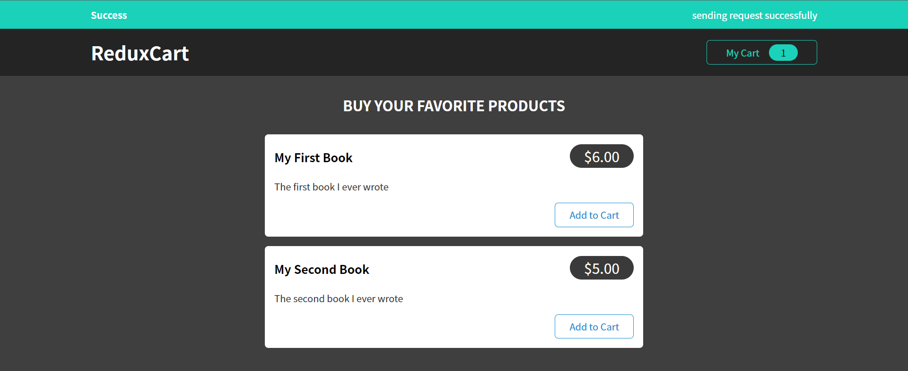

## 빼먹은 내용

1. 동적으로 list 렌더링 할 때 key 안씀
2. id field도 안씀
3. `find()` 함수 사용
   ```javascript
    addItemToCart(state, action) {
      const newItem = action.payload;
      const existingItem = state.items.find((item) => item.id === newItem.id);
      state.totalQuantity++;
      if (!existingItem) {
        state.items.push({
          id: newItem.id,
          price: newItem.price,
          quantity: 1,
          totalPrice: newItem.price,
          name: newItem.title
        });
      } else {
        existingItem.quantity++;
        existingItem.totalPrice = existingItem.totalPrice + newItem.price;
      }
    },
   ```
4. remove 함수에서 0이하가 되면 항목에서 없애기 (filter)
   ```javascript
    removeItemFromCart(state, action) {
      const id = action.payload;
      const existingItem = state.items.find(item => item.id === id);
      state.totalQuantity--;
      if (existingItem.quantity === 1) {
        state.items = state.items.filter(item => item.id !== id);
      } else {
        existingItem.quantity--;
      }
    },
   ```
5. plus 버튼 minus 버튼 add와 remove 함수를 이용할 수도 있음
   (따로 만들지 않고)

#

## redux로 http request 처리하기

Redux의 reducer 함수는 다음 조건을 만족해야한다.

- pure function
- side-effect free
- synchronous

따라서 reducer 안에 `fetch`함수를 집어 넣을 수가 없다.

개별 component에서 이 fetch 함수를 넣는 방법이 있는데 이는 로직없이 그대로 요청만 할 수 있다.
예를 들어 장바구니에 이미 있는 상품을 추가하면 배열의 갯수만 늘려줘야하고 없는 상품을 주문하면 새로 배열에 넣어 주어야 한다.
하지만 이러한 로직은 reducer 함수 또는 Backend API에 있는 것이므로 현재상황에선 적절하지 않은 방법이다.

따라서 다음과 같은 방법을 생각할 수 있다.
`App.js`에서 `useEffect`를 이용하여 `cart` 가 바뀔때마다 그의 상태를 데이터베이스에 업로드 해준다.

```javascript
useEffect(() => {
  const sendCartData = async () => {
    const response = await fetch(
      "https://meals-project-72c26-default-rtdb.firebaseio.com/cart.json",
      {
        method: "PUT",
        body: JSON.stringify(cart),
      }
    );
  };
  sendCartData();
}, [cart]);
```

여기에 몇가지 기능을 추가한다.

- Notification Component를 추가하여 현재의 상태를 알수 있는 바를 만든다
  
- `useEffect`는 처음로딩될 때도 실행되므로 `isStart`변수를 활용하여 처음에는 실행을 막는다.

`ui-slice`를 다음과 같이 업데이트 해준다. (notification)

```javascript
const uiSlice = createSlice({
  name: "ui",
  initialState: {
    cartIsVisible: false,
    notification: null,
  },
  reducers: {
    toggle(state) {
      state.cartIsVisible = !state.cartIsVisible;
    },
    showNotification(state, action) {
      state.notification = {
        status: action.payload.status,
        title: action.payload.title,
        message: action.payload.message,
      };
    },
  },
});
```

`useEffect` 로직을 다음과 같이 업데이트 해준다.

```javascript
useEffect(() => {
  const sendCartData = async () => {
    dispatch(
      uiActions.showNotification({
        status: "pending",
        title: "pending...",
        message: "sending request ...",
      })
    );

    const response = await fetch(
      "https://meals-project-72c26-default-rtdb.firebaseio.com/cart.json",
      {
        method: "PUT",
        body: JSON.stringify(cart),
      }
    );

    if (!response.ok) {
      throw new Error("something went wrong");
    }
    dispatch(
      uiActions.showNotification({
        status: "success",
        title: "Success",
        message: "sending request successfully",
      })
    );
  };
  if (isStart) {
    isStart = false;
    return;
  }
  sendCartData().catch((error) => {
    dispatch(
      uiActions.showNotification({
        status: "error",
        title: "Error",
        message: error.message,
      })
    );
  });
}, [cart, dispatch]);
```

#

## 액션 생성자 Thunk 사용하기 (**이부분 이해가 잘 안됨**)

`App.js`의 `useEffect` 부분을 `cart-slice` 부분으로 옮긴다.

```javascript
export const sendCartData = (cart) => {
  const someFunction = async (dispatch) => {
    dispatch(
      uiActions.showNotification({
        status: "pending",
        title: "pending...",
        message: "sending request ...",
      })
    );

    const response = await fetch(
      "https://meals-project-72c26-default-rtdb.firebaseio.com/cart.json",
      {
        method: "PUT",
        body: JSON.stringify(cart),
      }
    );

    if (!response.ok) {
      throw new Error("something went wrong");
    }

    try {
      dispatch(
        uiActions.showNotification({
          status: "success",
          title: "Success",
          message: "sending request successfully",
        })
      );
    } catch (error) {
      dispatch(
        uiActions.showNotification({
          status: "error",
          title: "Error",
          message: error.message,
        })
      );
    }
  };

  return someFunction;
};
```

`cart-slice`에서 비동기 함수를 반환하는 함수를 만든다.

```javascript
//App.js
useEffect(() => {
  if (isStart) {
    isStart = false;
    return;
  }
  dispatch(sendCartData(cart));
}, [cart, dispatch]);
```

#

## 데이터 가져오기

`cart-action.js` 파일을 따로 만들어주기

```javascript
export const fetchCartData = () => {
  return (dispatch) => {};
};
```

cart reducer에 fetching 된 데이터를 바꿔줄 함수를 만든다.

```javascript
replaceCart(state, action) {
      state.items = action.payload.items;
      state.totalQuantity = action.payload.totalQuantity;
    },
```

```javascript
export const fetchCartData = () => {
  return async (dispatch) => {
    const response = await fetch(
      "https://meals-project-72c26-default-rtdb.firebaseio.com/cart.json"
    );
    if (!response.ok) {
      throw new Error("fetching failed");
    }
    const newCartItems = await response.json();
    try {
      dispatch(cartActions.replaceCart(newCartItems));
    } catch (error) {
      dispatch(
        uiActions.showNotification({
          status: "error",
          title: "Error",
          message: error.message,
        })
      );
    }
  };
};
```

```javascript
//App.js
useEffect(() => {
  dispatch(fetchCartData());
}, [dispatch]);
```

여기까지 하면 두가지 문제점이 존재한다.

1.  시작할때 local의 cart items는 빈 배열이다. 하지만 fetching 을 통해 새로운 item 배열을 가져온다.  
     하지만 배열이 변하면 sendCartItem이 실행된다. 따라서 매번 새로고침을 누를 때마다 받아온 배열을 다시 서버로 보내게 된다.  
     해결책 : 로컽에서 변경된 경우에만 sendData 해준다.

    ```javascript
    const cartSlice = createSlice({
      name: "cart",
      initialState: {
        items: [],
        totalQuantity: 0,
        localChanged: false,
      },
      //...
    });
    ```

        그리고 add, remove item 들에서`state.localChanged = true` 로 바꿔준다.

    ```javascript
    useEffect(() => {
      if (isStart) {
        isStart = false;
        return;
      }
      if (cart.localChanged) {
        dispatch(sendCartData(cart));
      }
    }, [cart, dispatch]);
    ```

2.  item을 추가했다가 전부 빼서 빈 배열로 만들었을 경우에 fetch로 가져온 빈 배열을 find 하는 로직이 있으므로 오류가 난다.  
    해결책 : 전부 비었을 때는 빈배열을 넣어주기로 한다.

```javascript
    removeItemFromCart(state, action) {
      //...
      if (state.totalQuantity === 0) state.items = [];
    },
```

또는

```javascript
export const fetchCartData = () => {
  return async (dispatch) => {
    ...
    const newCartItems = await response.json();
    try {
      dispatch(
        cartActions.replaceCart({
          items: newCartItems ,
          totalQuantity: newCartItems.totalQuantity,
        })
      );
    }
    ...
  };
};
```
