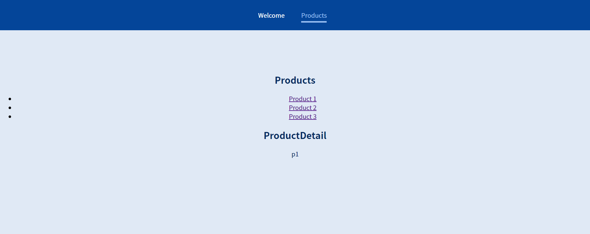

`npm install react-router-dom`

## Router 핵심 개념

여러 url 을 사용할 수 있게 하는 서드파티 라이브러리 `react-router-dom`

```javascript
//App.js
import { Route } from "react-router-dom";
function App() {
  return (
    <>
      <Route path='/welcome'>
        <Welcome />
      </Route>
      <Route path='/products'>
        <Products />
      </Route>
    </>
  );
}
```

```javascript
//index.js
import { BrowserRouter } from "react-router-dom";
ReactDOM.render(
  <BrowserRouter>
    <App />
  </BrowserRouter>,
  document.getElementById("root")
);
```

#

## 링크 연결하기

다음과 같이 `MainHeader`를 구성하면 네비게이션 바를 만들 수 있다.  
하지만 이 방법에는 치명적인 결함이 있는데 바로 `<a>` 태그를 사용하여 누를 때마다 새로운 페이지를 로딩한다는 것이다.  
예를 들어 이때까지 local에 저장해온 여러 state가 초기화된다는 것이다.  
따라서 라이브러리의 컴포넌트 `<Link>` 를 이용한다. (`href`는 `to`로 쓴다.)

```javascript
const MainHeader = () => {
  return (
    <>
      <header>
        <nav>
          <ul>
            <li>
              <a href='/welcome'>Welcome</a>
            </li>
            <li>
              <a href='/products'>Products</a>
            </li>
          </ul>
        </nav>
      </header>
    </>
  );
};
```

```javascript
const MainHeader = () => {
  return (
    <>
      {/*...*/}
      <Link to='/welcome'>Welcome</Link>
      {/*...*/}
    </>
  );
};
```

#

## NavLink 사용하기

NavLink를 사용하면 활성화 탭 표시를 더 쉽게 할 수 있다.
`NavLink` 태그를 사용한 후, `activeClassName`을 지정해주면 된다.


```javascript
const MainHeader = () => {
  return (
    <header className={classes.header}>
      <nav>
        <ul>
          <li>
            <NavLink activeClassName={classes.active} to='/welcome'>
              Welcome
            </NavLink>
          </li>
          <li>
            <NavLink activeClassName={classes.active} to='/products'>
              Products
            </NavLink>
          </li>
        </ul>
      </nav>
    </header>
  );
};
```

#

## 동적 라우팅

특정 제품의 상세 페이지인 `ProductDetail`을 만든다고 해도 p1 제품인지 p2 제품인지 식별이 필요하다.  
이를 위해 동적으로 인자를 넣어주는 방법은 다음과 같다.
`/:productID` 같은 방식으로 인자를 넣어주는 것이다.

```javascript
<Route path='/product-detail/:productID'>
  <ProductDetail />
</Route>
```

인자를 꺼내는 방법은 다음과 같다.

```javascript
import { useParams } from "react-router-dom/cjs/react-router-dom.min";
const params = useParams();
<p>{params.productID}</p>;
```

#

## switch / exact

페이지 라우팅도 디렉토리 개념으로 들어가는것이 직관적이다.
`products/productID 처럼  
따라서 다음과 같이 라우팅 해준다.

```javascript
    <Route path='/products'>
        <Products />
    </Route>
    <Route path='/products/:productID'>
        <ProductDetail />
    </Route>
```

그렇게 되면 문제가 생기는데 `/products` 로 시작하는 라우팅 페이지가 전부 렌더링 된다는 것이다.


해결 방법은 다음의 두가지가 있다.

1. Switch 이용
   그런데 Switch를 이용하면 위에서부터 읽어 내려 오면서 `/products`로 시작하는 처음것을 렌더링 한다.  
   따라서 라우팅 페이지의 순서를 바꾸어 주어야한다.

```javascript
<Switch>
  <Route path='/welcome'>
    <Welcome />
  </Route>
  <Route path='/products/:productID'>
    <ProductDetail />
  </Route>
  <Route path='/products' {/*이 부분이 밑으로 내려가야 함*/}>
    <Products />
  </Route>
</Switch>
```

2. exact 키워드를 사용하면 정확히 맞는 링크만 로드하게 된다.

```javascript
<Switch>
  <Route path='/welcome'>
    <Welcome />
  </Route>
  <Route path='/products' exact>
    <Products />
  </Route>
  <Route path='/products/:productID'>
    <ProductDetail />
  </Route>
</Switch>
```

## 중첩 경로

어디서든 Route를 사용할 수 있음

## 사용자 리디렉션

아무것도 없는 도메인 주소를 입력했을때 특정 페이지로 이동시키고 싶을때 사용한다.  
예를 들어 `domain.com` 에 접근하면 아무것도 없는데 `domain.com/welcome`에는 무언가 있어 처음 방문하는 사람을 이쪽으로 유도하고 싶다면 다음과 같은 코드를 작성하면 된다. (`<Route path='/' exact>` 이 부분의 `exact`는 매우 중요하다.)

```javascript
<Route path='/' exact>
  <Redirect to='/welcome' />
</Route>
<Route path='/welcome'>
  <Welcome />
</Route>
<Route path='/products/:productID'>
  <ProductDetail />
</Route>
<Route path='/products' exact>
  <Products />
</Route>
```
