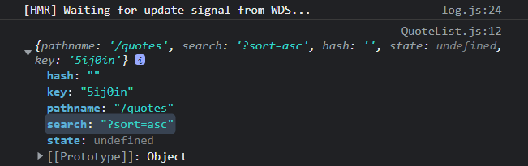

## Layout

```javascript
import React from "react";
import MainNavigation from "./MainNavigation";
import classes from "./Layout.module.css";
const Layout = (props) => {
  return (
    <>
      <MainNavigation />
      <main className={classes.main}>{props.children}</main>
    </>
  );
};

export default Layout;
```

```javascript
function App() {
  return (
    <Layout>
      <Switch>
        <Route path='/' exact>
          <Redirect to='quotes' />
        </Route>
        <Route path='/quotes' exact>
          <AllQuotes />
        </Route>
        <Route path='/quotes/:quoteId'>
          <Details />
        </Route>
        <Route path='/new-quote'>
          <NewQuote />
        </Route>
      </Switch>
    </Layout>
  );
}
```

#

## 동적 라우팅으로 링크를 찾지 못한 경우

```javascript
<Route path='*'>
  <NotFound />
</Route>
```

## 프로그래밍 방식(필수) 탐색 구현하기

폼을 제출하고 다른 페이지로 이동시킬 수 있는 훅
push : 이동후 back 버튼을 클릭하면 이전으로 돌아감  
replace : 돌아가지 못함

```javascript
const NewQuote = () => {
  const history = useHistory();
  const addQuoteHandler = (quoteData) => {
    console.log(quoteData);
    history.replace("/quotes");
  };
  return (
    <div>
      <QuoteForm onAddQuote={addQuoteHandler} />
    </div>
  );
};
```

## 페이지 이탈 막기( Form )

1.  `const [isEntering, setIsEntering] = useState(false);`
    입력이 진행중이었는지 판단
2.  ```javascript
    <form
      onFocus={() => {
        setIsEntering(true);
      }}
      className={classes.form}
      onSubmit={submitFormHandler}
    ></form>
    ```
3.  `<Prompt when={isEntering} message='finish?' />` 넣어줌
4.  제출 버튼 누를 때
    ```javascript
    <button
      className='btn'
      onClick={() => {
        setIsEntering(false);
      }}
    >
      Add Quote
    </button>
    ```

#

## 쿼리 매개변수 작업하기

- location을 이용하면 쿼리를 볼 수 있다.

  ```javascript
  const location = useLocation();
  console.log(location);
  ```

  

- URLSearchParams을 이용하면 매개변수를 추출할 수 있다.

  ```javascript
  const queryParams = new URLSearchParams(location.search);
  const SortingMethod = queryParams.get("sort");
  ```

- 매개변수를 받아서 정렬해준다.

  ```javascript
  const history = useHistory();
  const location = useLocation();
  const queryParams = new URLSearchParams(location.search);
  const SortingMethod = queryParams.get("sort") || "asc";

  const sortQuotes = (quotes, ascending) => {
    return quotes.sort((quoteA, quoteB) => {
      if (ascending === "asc") {
        return quoteA.id > quoteB.id ? 1 : -1;
      } else {
        return quoteA.id < quoteB.id ? 1 : -1;
      }
    });
  };
  const sortedQuotesData = sortQuotes(props.quotes, SortingMethod);
  const sortingButtonHandler = () => {
    history.push("/quotes?sort=" + (SortingMethod === "asc" ? "desc" : "asc"));
  };
  ```

## 네스트 route 유연하게 적용

라우트 링크를 하드코딩 하면 링크가 바뀌었을 때 전부 바꿔주어야 한다.  
이러한 상황을 방지하기 위해서 동적으로 현재 링크를 넣어준다.
`useRouteMatch()` 를 이용해서 `match.url`로 접근해도 되고  
`useLocation()` 을 이용해서 `location.pathname`로 접근해도 된다.

```js
const match = useRouteMatch();
<Switch>
  <Route path={`${match.url}`} exact>
    <div className='centered'>
      <Link className='btn--flat' to={`${match.url}/comments`}>
        comments
      </Link>
    </div>
  </Route>
  <Route path={`${match.url}/comments`}>
    <Comments />
  </Route>
</Switch>;
```

```js
const location = useLocation();
const sortingButtonHandler = () => {
  history.push(
    `${location.pathname}?sort=${SortingMethod === "asc" ? "desc" : "asc"}`
  );
};
```

- 다음처럼 가독성을 높일 수 있다.

```js
history.push({
  pathname: match.url,
  search: `?sort=${SortingMethod === "asc" ? "desc" : "asc"}`,
});
```

## 서버에서 불러오기

**여기서 제공되는 useHttp랑 api.js 좀 봐야겠다..**
useHttp는 어떤 api를 불러와서 상태를 추가하고 데이터를 받아서 배열로 보내주는 커스텀 훅이다.
api는 어떤 api를 불러오는 함수들이다.

```js
//newQuote에서
const { sendRequest, status } = useHttp(addQuote);

useEffect(() => {
  if (status === "completed") {
    history.replace("/quotes");
  }
}, [status, history]);
const addQuoteHandler = (quoteData) => {
  sendRequest(quoteData);
};
```

```js
const {
  sendRequest,
  status,
  data: loadedQuotes,
  error,
} = useHttp(getAllQuotes, true);

useEffect(() => {
  sendRequest();
}, [sendRequest]);

if (status === "pending") {
  return (
    <div className='centered'>
      <LoadingSpinner />
    </div>
  );
}
if (error) {
  return <p className='centered focused'>{error}</p>;
}
if (status === "completed" && loadedQuotes.length === 0) {
  return <NoQuotesFound />;
}

return (
  <div>
    <QuoteList quotes={loadedQuotes || []} />
  </div>
);
```

## quoteId 를 이용해서 Detail 페이지 로딩

detail 페이지를 로딩하기 위해서 find를 사용하는 것이 아닌 다른 api이용.
로딩 속도를 빠르게 한다. param의 구조분해할당을 이용해서 quoteId를 찾아낸다.

```js
const param = useParams();

const {
  sendRequest,
  status,
  data: quote,
  error,
} = useHttp(getSingleQuote, true);
const { quoteId } = param;

useEffect(() => {
  sendRequest(quoteId);
}, [sendRequest, quoteId]);
```

v5 v6 다른점
https://kyung-a.tistory.com/36
