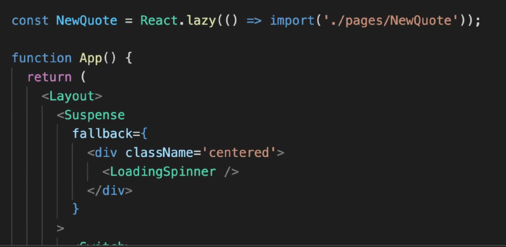
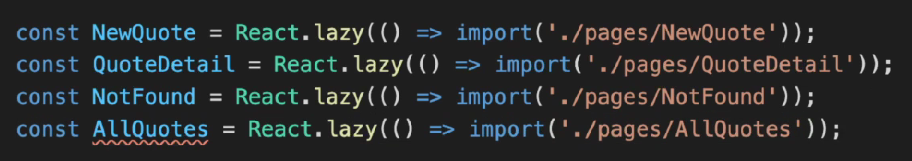
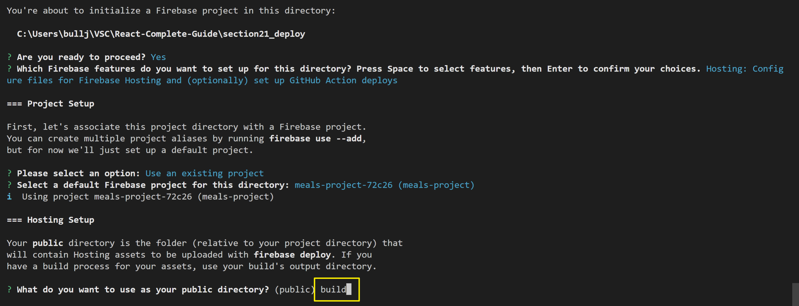
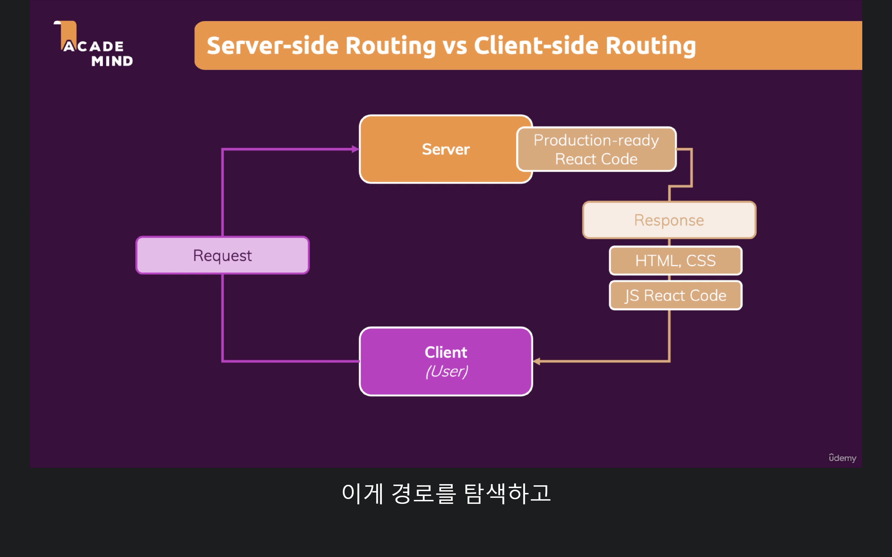
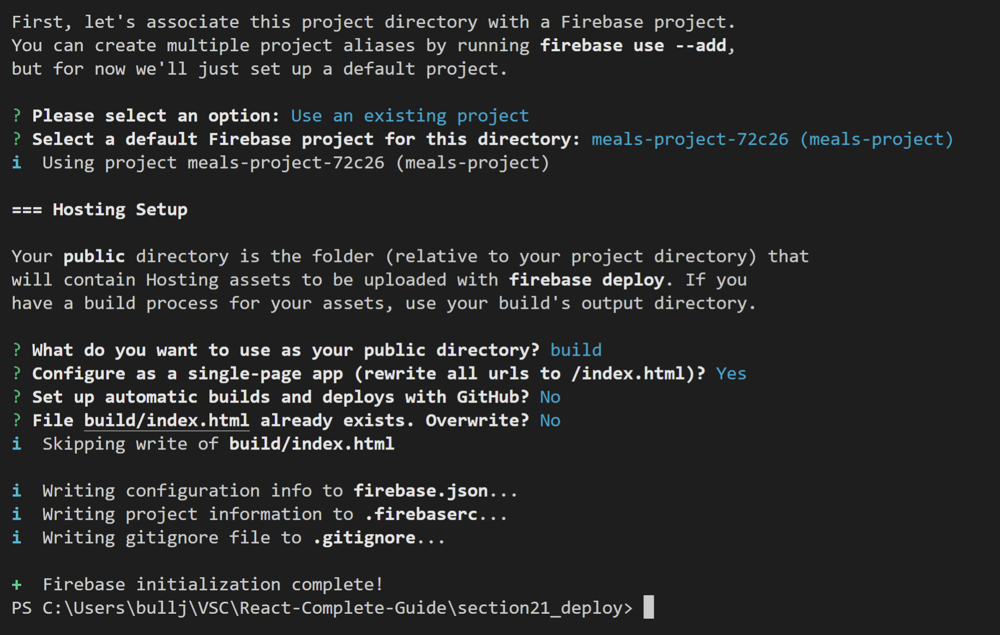

## 정적 호스팅 제공자

[firebase](https://firebase.google.com/docs/cli?authuser=0#mac-linux-npm)
`npm install -g firebase-tools`

[로그인하기](https://firebase.google.com/docs/cli?authuser=0#sign-in-test-cli)
`firebase login`
`firebase init`

## 서버 세팅

다음 그림을 보면 서버로 어떤 url을 요청하게 되는데 우리가 라우팅에서 사용한 디렉토리도 읽게 된다.
하지만 로컬에서 라우팅을 사용하는 것이므로 url 뒤에 무엇이 오던지 index.html을 요청해야 한다.
따라서 url 뒤쪽 주소는 무시하는 설정을 해야하는 것이다.

`firebase deploy`

내리고 싶을 땐 `firebase hosting:disable`
